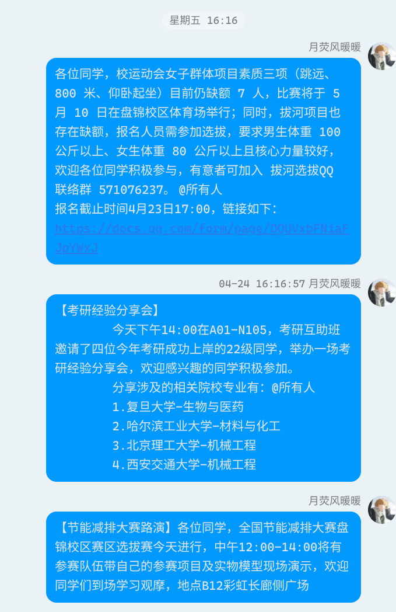
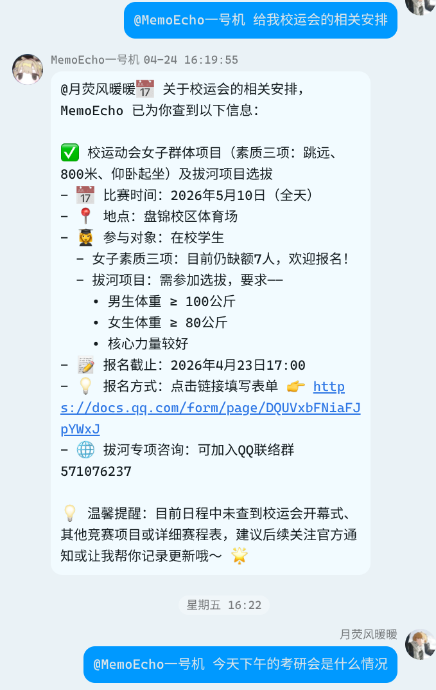
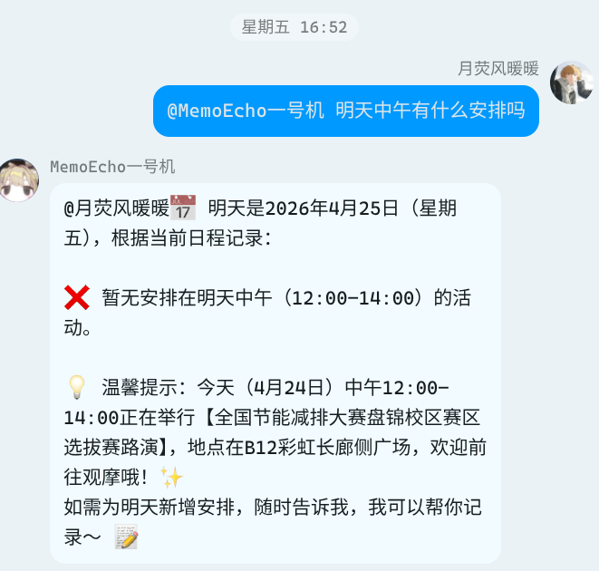
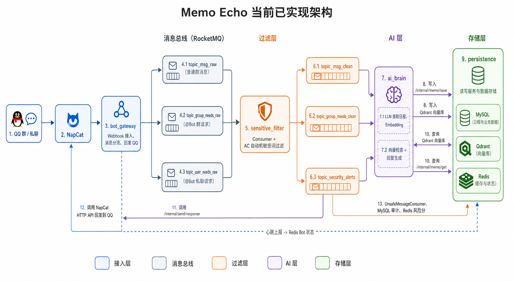

<div align="center">

# **MemoEcho**
---

> **Memo Echo** 是一个面向群聊场景的智能助理，核心目标是从纷繁复杂的群聊信息中，监控并提取*日程*信息，像*秘书*一样可以让用户用*自然语言*查询日程。

  

</div>


## 项目介绍
---
本项目是面向与工作性的群聊软件中的日程管理以及询问。现代社会中，人们往往淹没与信息的洪流中，本项目志在帮助用户引入智能体机器人来识别并记忆群聊中的日程信息。可以让用户通过@机器人帐号的方式用自然语言查询相关日程。

由于本项目的开发时间比较短 ~~(开发者还是学生)~~，以后会不断优化与完善并且提供更多功能。

**核心功能:**

- 机器人消息接入、回复和主动控制(管理员端)
- 群聊消息敏感词过滤与风险监控(管理员端)
- 日程消息抽取、结构化存储与向量检索
- 普通用户注册、登录、提交群日程托管申请
- 管理员审核群申请、管理群聊与好友、发送消息

## 效果展示

面对群聊中密集的信息轰炸，只需 @MemoEcho，即可随时获取清晰的日程安排。

| 📥 杂乱的原始群通知 | 📤 MemoEcho 的智能响应 |
| :---: | :---: |
|  |  |
| *辅导员发布的长篇校运会、考研分享会通知...* | *自动提取时间、地点、要求，条理清晰地返回* |

此外，**MemoEcho** 还能通过查询结果推断用户是否有记错时间。



## 项目架构图



## 项目结构
---

```text
Memo_Echo
├── api_gateway         网关入口
├── bot_gateway         机器人协议网关
├── sensitive_filter    敏感词过滤与风控分发
├── ai_brain            智能解析与向量化处理
├── persistence         持久化、鉴权、管理接口
├── memo_echo_apis      公共 DTO / VO / Feign 接口
├── memo_echo_common    通用响应体与基础工具
└── fore                前端管理台
```
## 技术栈
---
**后端核心**
- **开发环境**: Java 17
- **基础框架**: Spring Boot 3.2, Spring Cloud
- **服务治理**: Spring Cloud Alibaba Nacos

**中间件与存储**
- **消息队列**: RocketMQ
- **关系型数据库**: MySQL, MyBatis-Plus
- **缓存与键值对**: Redis
- **向量数据库**: Qdrant (用于 AI 语义检索)

**前端与机器人**
- **管理后台**: Vue 3 + Vite
- **机器人协议**: NapCat / OneBot

## 快速启动
> 如何看快速本地部署指南
### 运行前准备
请先准备以下基础服务：

- Nacos
- RocketMQ NameServer
- MySQL
- Redis
- Qdrant
- NapCat / OneBot 机器人环境

### 模块端口
| 模块 | 端口 | 说明 |
| --- | --- | --- |
| `api_gateway` | `8090` | 网关入口 |
| `bot_gateway` | `8080` | 机器人协议网关 |
| `sensitive_filter` | `8180` | 敏感词过滤 |
| `persistence` | `8280` | 鉴权、数据持久化、管理接口 |
| `ai_brain` | `8380` | AI 解析与向量化处理 |
| `fore` | `5173` | 前端开发端口，Vite 会自动避开占用端口 |

### 1. 启动基础设施

确保以下服务可用：

- Nacos: `127.0.0.1:8848`
- RocketMQ NameServer: `127.0.0.1:9876`
- MySQL: `localhost:3307`
- Redis: `localhost:6380`
- Qdrant: `127.0.0.1:6334`

### 2. 启动后端模块

推荐按下面顺序启动：

```bash
mvn -pl api_gateway spring-boot:run
mvn -pl persistence spring-boot:run
mvn -pl sensitive_filter spring-boot:run
mvn -pl ai_brain spring-boot:run
mvn -pl bot_gateway spring-boot:run
```

如果你想一次性编译整个后端：

```bash
mvn clean test
```

### 3. 启动前端

```bash
cd fore
npm install
npm run dev
```

打包前端：

```bash
cd fore
npm run build
```

### 4. 启动机器人网关测试环境

如果要完整测试 `bot_gateway`，需要先启动 NapCat。可以用 Docker Compose 起一个本地实例，并把 webhook 指向网关：

```yaml
services:
  napcat:
    image: mlikiowa/napcat-docker:latest
    container_name: memo_echo_napcat
    environment:
      - WEBHOOK_URL=http://localhost:8080/api/bot/webhook
    volumes:
      - ./napcat/config:/app/napcat/config
      - ./napcat/qq:/app/.config/QQ
    ports:
      - "6099:6099"
      - "3011:3011"
    restart: always
```
启动后登录 NapCat WebUI：
- `http://127.0.0.1:6099/webui/`

### 5. 环境变量

项目支持部分敏感配置通过环境变量注入：

- `JWT_SECRET`
- `AES_KEY`

如果不设置，会使用本地默认值，但正式环境不建议沿用默认值。

## 相关文档

- 接口规范: [`memo_echo_apis/APIS规范.md`](memo_echo_apis/APIS规范.md)
- 前端说明: [`fore/README.md`](fore/README.md)
- 机器人部署说明: [`document/readme.md`](document/readme.md)

## 🤝 参与贡献
---
欢迎大家提交 Issue 和 Pull Request！如果你有好的想法或发现了 Bug，请随时与我联系。
由于开发者目前还是学生，精力和时间有限，回复可能不够及时，请谅解~ ❤️


## 📞 联系作者
---
- **Email**: 
  - [Sisfuze的邮箱](zhou.yifei15450@gmail.com)
- **Blog / GitHub**:
   - [Sisfuze](https://github.com/Sisfuzues/Memo_Echo)

## 🙏 特别感谢

除了众多优秀的开源框架外，特别感谢以下个人对本项目的帮助与贡献：

<div align="left">
  <a href="https://github.com/DreamyGlaze">
    
  </a>
  <a href="https://github.com/zoujan1433223-lgtm">
    
  </a>
  <a href="https://github.com/big-orange947">
    
  </a>
  <a href="https://github.com/zoujan1433223-lgtm">
    
  </a>
</div>

*如果你也对本项目感兴趣，欢迎成为我们的代码贡献者！*