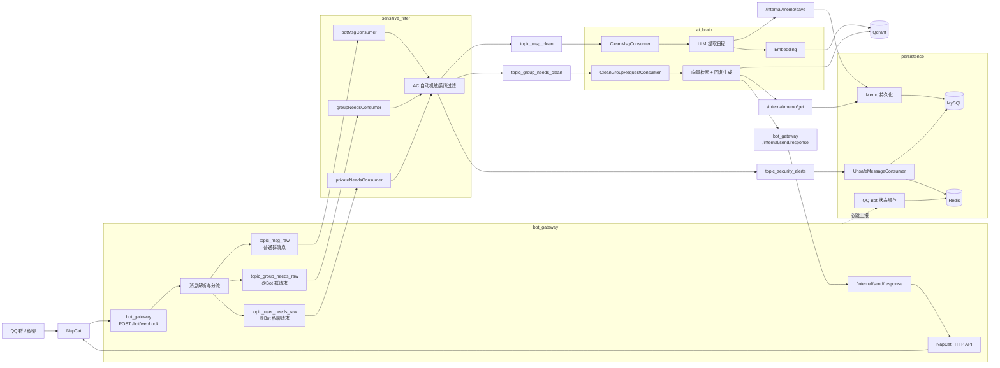

# Memo Echo

面向 QQ 群场景的赛博秘书原型系统。当前仓库已经落地的是一条可拆分的消息驱动链路：`NapCat -> bot_gateway -> RocketMQ -> sensitive_filter -> ai_brain -> persistence`。

本文档只描述当前代码里已经实现的模块和链路，不写未接入或未打通的功能。

## 当前架构图



## 已落地模块

- `bot_gateway`
  - 接收 NapCat Webhook
  - 解析 QQ 消息并按场景分发到 RocketMQ
  - 提供回发 QQ 消息的内部接口和基础管理接口

- `sensitive_filter`
  - 消费原始消息 Topic
  - 使用 AC 自动机做敏感词过滤
  - 将危险消息投递到告警 Topic
  - 将可继续处理的消息投递到 clean Topic

- `ai_brain`
  - 对普通群消息做日程抽取
  - 将抽取结果写入 `persistence`
  - 将原始文本做向量化后写入 Qdrant
  - 对群内 `@Bot` 查询请求做向量检索并生成回复

- `persistence`
  - 持久化日程数据
  - 持久化敏感消息审计数据
  - 使用 Redis 缓存 QQ Bot 状态和群风险分

## 当前已实现的主流程

### 1. 群消息录入日程

```text
NapCat -> bot_gateway -> topic_msg_raw
-> sensitive_filter -> topic_msg_clean
-> ai_brain 提取日程
-> persistence 写 MySQL
-> ai_brain 写 Qdrant
```

### 2. 群内 @Bot 查询日程

```text
NapCat -> bot_gateway -> topic_group_needs_raw
-> sensitive_filter -> topic_group_needs_clean
-> ai_brain 检索 Qdrant + 查询 persistence
-> bot_gateway 回发 QQ
```

### 3. 敏感消息审计

```text
NapCat -> bot_gateway -> RocketMQ
-> sensitive_filter 命中敏感词
-> topic_security_alerts
-> persistence 落 MySQL 并累计 Redis 风险分
```

## 说明

- 当前 Webhook 入口是 `POST /bot/webhook`
- 当前消息总线是 `RocketMQ`
- 文档只保留已实现链路，未接入的功能不在此处展开
