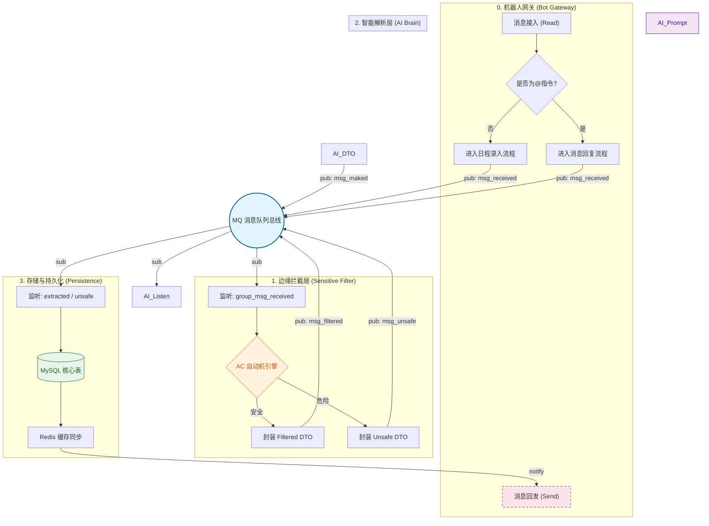

# ReadMe
## 快速启动
如果你想测试**bot_gateway** 模块的话，你首先需要在本地用*docker*部署一个**Napcat**。
详细的部署流程太繁琐，我这里写一个临时的*docker compose*文件。

```yaml
services:
      napcat:
        image: mlikiowa/napcat-docker:latest
        container_name: memo_echo_napcat
        environment:
          # ⚠️ 注意：这里填你的 SpringBoot 网关接收地址
          - WEBHOOK_URL=http://localhost:8080/api/bot/webhook
        volumes:
          - ./napcat/config:/app/napcat/config
          - ./napcat/qq:/app/.config/QQ
        ports:
          - "6099:6099"
          - "3011:3011"
        restart: always
```
然后你需要在这个文件所在的文件夹用命令行输入如下命令：
```bash
sudo docker compose up -d 
```
这个是启动**Napcat**,然后你需要查看日志：
```bash
sudo docker logs --tail 50 memo_echo_napcat
```
扫码登录机器人帐号，随后去这个网址更改配置：[Napcat_UI](http://127.0.0.1:6099/webui/)。
具体配置如下：


## 流程图

